# GoogleAuthentication

## How to

### Step 1

Go to : https://console.cloud.google.com and create a Project

### Step 2

Go to API & Services -> Credentials ( https://console.cloud.google.com/apis/credentials)

### Step 3

Create a `OAuth client ID` credntial

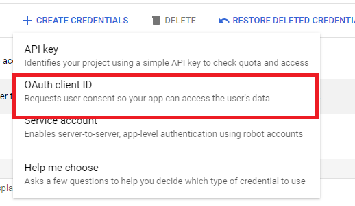

### Step 4

Click on `CONFIGURE CONSENT SCREEN`

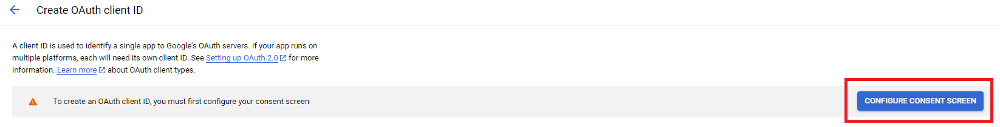

### Step 5

Use External and `CREATE`

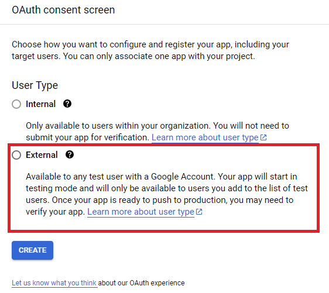

### Step 6

Fill the relvant information. For App Domain add the Application's (Frontend) URL and add the developer contact email as your email. Finally Go to Next

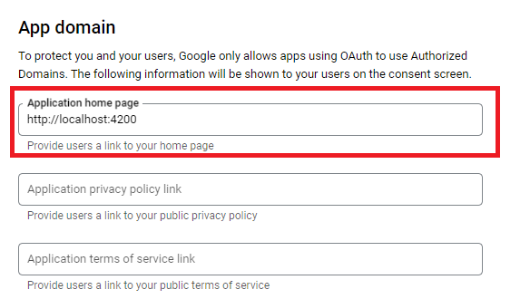

### Step 7

Then in the `Scopes` area, Select `ADD OR REMOVE SCOPES`
Select the scopes according to your requirement. Since I need the user's email and the basic level details. I click the first two scopes.

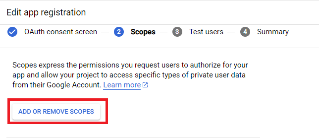

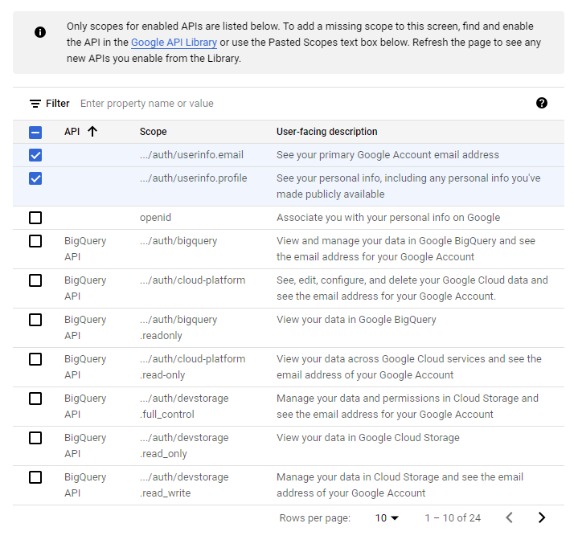

### Step 8

Then move to next Test Users and Summary area by without editing anything and finally you will be redirected to dashboard again.

### Step 9

Now again select `Credentials` from the side bar. This time you will see a drop down. Select the application type you want. In my case it's web application.

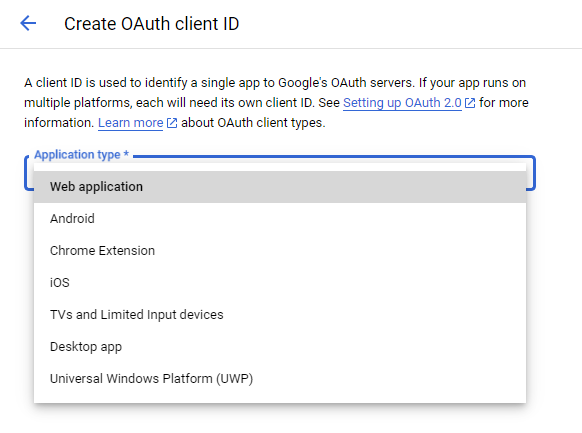

### Step 10

Add a App name. And then add the URLs that the request will be originated from to the `Authorized JavaScript origins` (Since I am requesting from localhost I add both exact base url and the port as well )
Then also add a redirect URL in `Authorized redirect URIs` where user should be navigated after the successful login

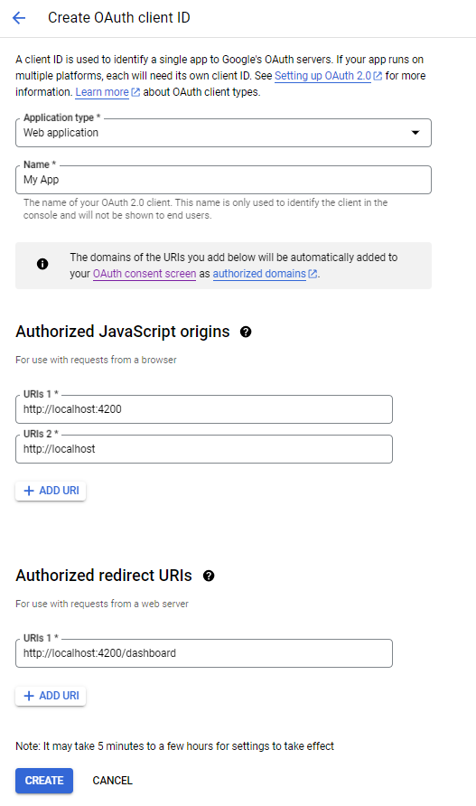

### Step 11

Once you click the create. You will have the credentials needed for the process. (Download and safe keep the generated credentials is better)

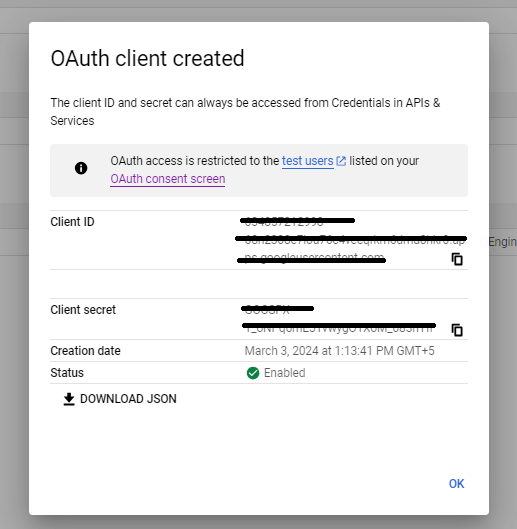

### Step 11

Now since credentials are ready. Go to https://developers.google.com/identity/gsi/web/guides/get-google-api-clientid

There you can click the `Load the client library` from side bar menu and load the Javscript library to your main html file (in most frameworks it's `index.html`).

Add it to your `<head>` tag in the `index.html`

```Javascript
<script src="https://accounts.google.com/gsi/client" async></script>
```

### Step 12

Now click the `Generate the integration code`.

There, add your above generated Client Id to the `Google Client ID` field. Select a context. (In my case I'll consider a sign in).

For `Login URI` add the backend REST endpoint created for the Login from you backend.

> **_NOTE:_** If you don't have a backend. Put some frontend url there. It will be not useful however. But since this is a required field, we need to add some URL.

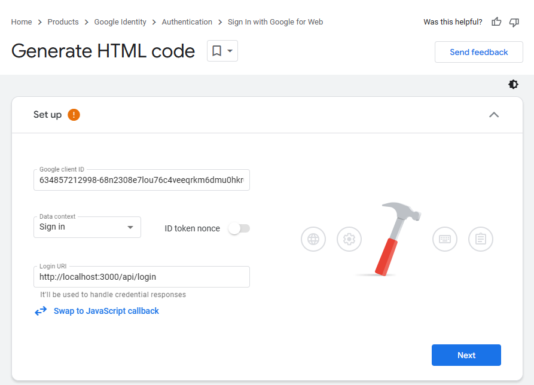

### Step 13

Then select a sign in method. I'll use `Sign in with Google` Button.

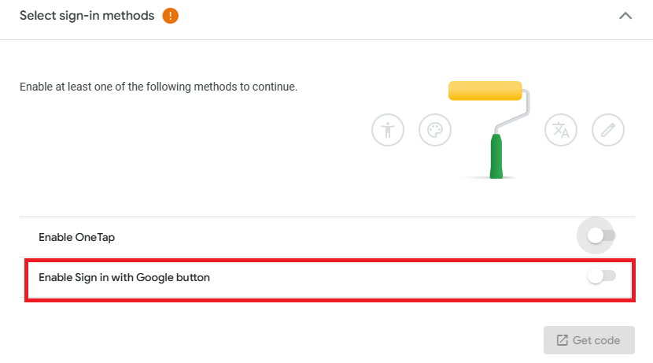

### Step 14

Then you can do your customization. After that click `Get code`. You will receive a html code like below.

```html
<div id="g_id_onload" data-client_id="<YOUR_CLIENT_ID_WILL_BE_HERE>" data-context="signin" data-ux_mode="popup" data-auto_prompt="false"></div>

<div class="g_id_signin" data-type="standard" data-shape="rectangular" data-theme="outline" data-text="signin_with" data-size="large" data-logo_alignment="left"></div>
```

### Step 14

Now, from the first `<div>` tag, I will remove the `data-login_uri="http://localhost:3000/api/login"` property and add the `  data-callback="handleCredentialResponse"`. Reason for that is I need to get the details of the user after the login. The function name `handleCredentialResponse` will be a choice of your own.

### Step 15

Define the function `handleCredentialResponse` in `index.html` under the `<head>` tag using vanila javascript function.

````Javascript
    <script>
      function decodeJWTToken(token) {
        return JSON.parse(atob(token.split(".")[1]));
      }

      function handleCredentialResponse(response) {
        const responsePayload = decodeJWTToken(response.credential);
        sessionStorage.setItem("loggedInUser", JSON.stringify(responsePayload));
        window.location.href = "/dashboard";
      }
    </script>
```
````

First we accept the callback response for the our custom made function (`handleCredentialResponse`). That response have a JWT token. It should be decoded. For that we can use the `decodeJWTToken` function. Once it is decoded we can have the details of the logged in user. We can then either store it in sessionStorage or localStorage as a string.

Finally using `window.location.href` we can redirect the logged in user to particular URL that he should be see after login.

To use the details of the logged in user, We can use the following method to retrieve the data from the session storage.

```Javascript
     loggedInUser = JSON.parse(
      sessionStorage.getItem('loggedInUser') || ''
    );
```

Need to use `JSON.parse()` since sessionStorage store items as string.

Following data will be available to the application if you select the email and profile scopes when creating OAuth Consent Screen

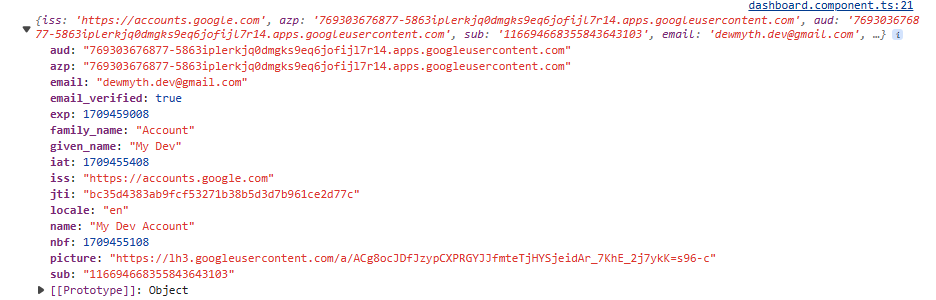

Final output of this Application

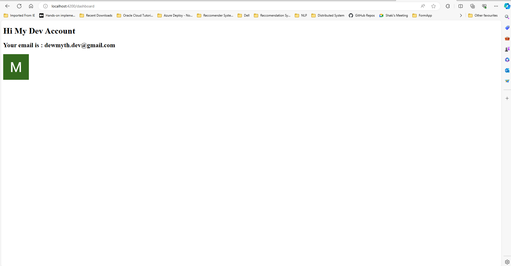
